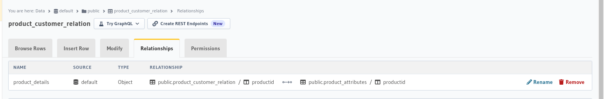

### Flask Hasura Apis

#### Urls

Hasura url = [Hasura-url](http://0.0.0.0:23003/console)
Elastic Search Url = [Elastic Search URL](http://0.0.0.0:9200/)
Elastic Search index count Url = [Elastic Search index count URL](http://0.0.0.0:9200/2024/_count)
Kibana Url = [Kibana Url](http://0.0.0.0:5601/)

#### Requirements

docker and docker-compose

```bash
docker-compose build 
docker-compose up -d
```

#### Required Relationships in Hasura





#### ElasticSearch 

Elastic Search Url


Elastic Index Count Url


Elastic Search Health 


#### Kibana 

Home Page 


**Logs Page**

You need to create search pattern for 2024

